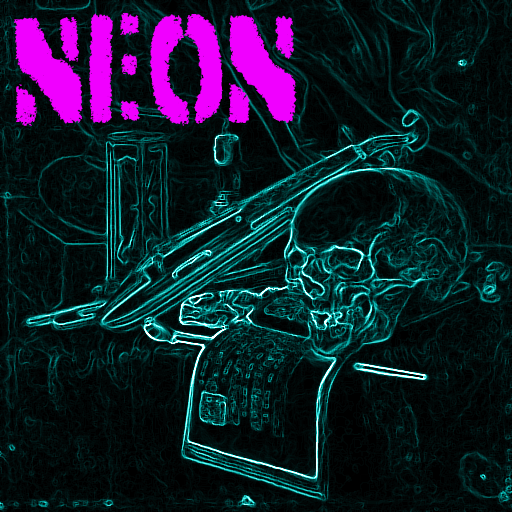

<h1>neon</h1>

 
<code><a href="https://commons.wikimedia.org/wiki/File:A_Vanitas-_A_Skull,_a_Violin,_a_Music_Score,_a_Pipe_and_Tobacco,_an_Hourglass_and_a_guttering_Candle_on_a_draped_Table(113520).jpg">
  the logo is based off a public domain Simon Renard de Saint-André painting
</a></code>

 
all the configurations I use for music on my desktop in the future I hope to make my own utility with not curses or something but for now this is what I have

